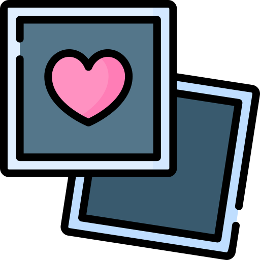

  

<h1 align="center">Memories-Map</h3>

    📷 App to save and share memories by locations built with NextJs + Graphql
     
    <a href="https://memories-map.rinem.in/"><strong>View the demo »</strong></a>
     
     
    <a href="https://github.com/rinem/memories-map/issues">Report Bug</a>
    ·
    <a href="https://github.com/rinem/memories-map/issues">Request Feature</a>
  

Memories Map allows users to chart their personal journeys through a customizable digital map interface. Whether it's recalling cherished vacations, favorite local spots, or significant life moments, users can effortlessly mark locations with images, creating an interactive tapestry of memories. Explore your world through the lens of your experiences, and share your stories with friends and loved ones.

## Features ✨

- 📍 Share memories as markers on map with image upload
- 🌏 Interactive map to navigate the placesments
- 🕵 Quickly locate specific memories with location search feature
- 🎨 Beautiful design with dark mode

## Technologies Used 💻

- **Frontend:** React, NextJs, Tailwind CSS, Apollo-client, Mapbox
- **Backend:** Firebase Auth, Prisma, Graphql, Google Maps

## Features to add
- [ ] Add a description to the memory
- [ ] Ability to create a shareable link of specific section of map

## Author

👤 **Roshan Mishra**

- Website: [portfolio](https://portfolio.rinem.in)
- Twitter: [@_rinem_](https://twitter.com/_rinem_)
- Github: [@rinem](https://github.com/rinem)

## Show your support

Give a ⭐️ if you liked the project!

## 📝 License

This project is [MIT License](https://github.com/rinem/memories-map/blob/main/LICENSE) licensed.
